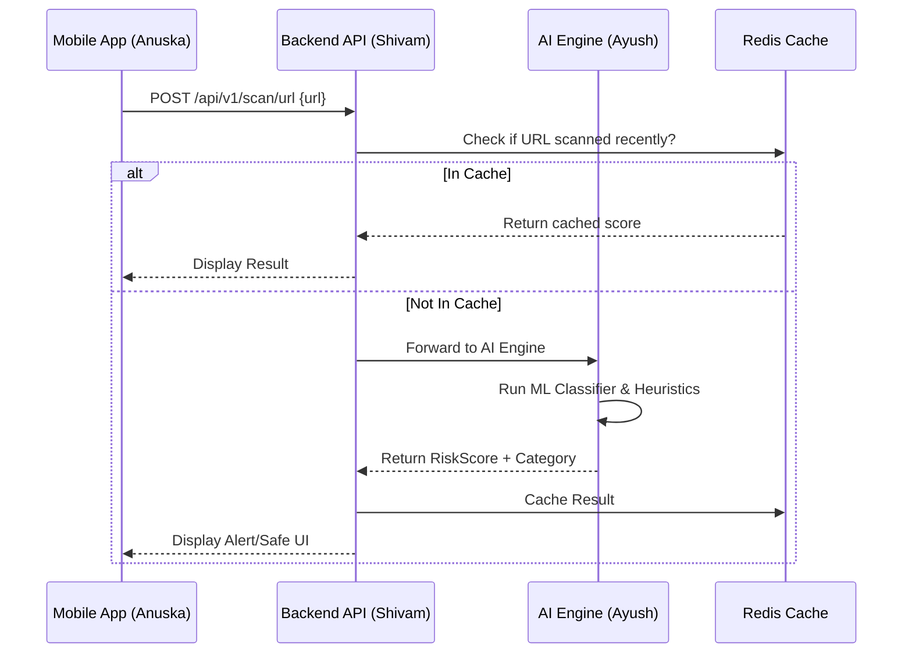
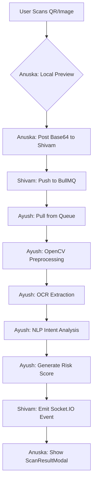

# SENTINELAI - PROJECT CONTEXT & ARCHITECTURE BLUEPRINT

> **IMPORTANT**: This document is the primary source of truth for all AI coding agents and human developers. It defines the architecture, responsibilities, and integration flows for the Cyber Shield AI suite.

---

## 1. PROJECT OVERVIEW
**Project Name**: Cyber Shield AI  
**Vision**: An enterprise-grade, AI-powered cybersecurity ecosystem designed to protect mobile users from real-time threats through advanced scanning, heuristic analysis, and community-driven threat intelligence.

### Core Protection Areas
- **Phishing**: Real-time URL and link analysis.
- **Scams**: OCR-based detection of WhatsApp/SMS/QR scams.
- **App Safety**: Malicious APK and overlay attack detection.
- **Financial Security**: Banking fraud and remote access prevention.
- **Family Safety**: Emergency alerts for suspicious activity on linked devices.

---

## 2. TECHNOLOGY STACK

| Component | Technology | Role |
| :--- | :--- | :--- |
| **Frontend Mobile** | React Native + TypeScript | Anuska's Domain |
| **State Management** | Redux Toolkit | Global App State |
| **Storage** | MMKV | High-performance secure storage |
| **Backend API** | Node.js + Express + TS | Shivam's Domain |
| **Database/ORM** | PostgreSQL + Prisma | Persistent Storage |
| **Task Queue** | Redis + BullMQ | Async scanning & notifications |
| **AI Engine** | Python 3.14 + FastAPI | Ayush's Domain |
| **ML Libraries** | Scikit-learn, TensorFlow | Threat classification |
| **OCR** | Pytesseract / OpenCV | Text extraction from media |
| **Infrastructure** | Docker, K8s, AWS | Deployment |

---

## 3. MONOREPO STRUCTURE & OWNERSHIP

```text
cyber-shield-app/
├── apps/
│   ├── mobile-app/           # [ANUSKA] UI, Navigation, Redux, Local Sensors
│   ├── backend-api/          # [SHIVAM] Auth, DB, AI-Proxy, Socket.IO
│   ├── ai-engine/            # [AYUSH] ML Models, Scanners, OCR Pipeline
│   └── admin-dashboard/      # Analytics, User Management, Global Monitoring
├── packages/
│   ├── shared-types/         # Unified TypeScript interfaces for all services
│   ├── shared-utils/         # Common validators and formatters
│   └── ui-kit/               # Reusable React components (Design System)
├── infrastructure/           # Docker, K8s, Terraform, CI/CD
├── docs/                     # Architectural ADRs, API Specs
└── scripts/                  # DevOps and setup automation
```

---

## 4. ROLE-SPECIFIC CONTEXT

### PART A: ANUSKA (Frontend Mobile)
**Architecture**: Atomic Design + Feature-based organization.
- **Navigation**: Uses `RootNavigator` with a `Switch` pattern for Auth vs. Main states.
- **State Flow**: Components dispatch actions -> Redux Slices -> Axios Middleware -> Backend API.
- **Scanner UI**: High-priority. Must handle camera permissions and real-time visualization of AI "Thinking" states.
- **Security Logic**: Implements Root Detection and SSL Pinning.

### PART B: SHIVAM (Backend API)
**Architecture**: Controller-Service-Repository Pattern.
- **Prisma**: Manages complex relations between `User`, `Device`, `ScanHistory`, and `Alerts`.
- **AI Gateway**: The backend does NOT wait for AI results synchronously for heavy tasks. It pushes to `ScanQueue` (Redis) and notifies the mobile app via WebSockets/FCM.
- **Auth**: JWT with HTTP-only refresh tokens.

### PART C: AYUSH (AI Detection Engine)
**Architecture**: Modular Pipeline (Extract -> Analyze -> Score -> Classify).
- **OCR Pipeline**: Handles image cleanup via OpenCV before Tesseract extraction.
- **Heuristic Engine**: Fast, non-ML checks for domain homographs and common scam keywords.
- **Scoring System**: Returns a `RiskScore` (0.0 - 1.0) with an `Explanation` string to be displayed to the user.

---

## 5. FEATURE FLOW DIAGRAMS

### URL Phishing Scan Flow


### QR/OCR Scam Detection Flow


---

## 6. DATABASE SCHEMA LOGIC (Prisma)

- **User**: Core profile. 1:N with Devices.
- **Device**: Tracks unique hardware IDs and FCM tokens for notifications.
- **Scan**: Polymorphic table. Tracks `ScanType` (URL, QR, APK) and links to the detecting User.
- **ThreatLog**: Anonymized global log used to improve Ayush's ML models.
- **FamilyAlert**: Tracks linked accounts for real-time emergency broadcasts.

---

## 7. AI CODING AGENT RULES (STRICT MODE)

**When generating code for this project, AI agents MUST follow these rules:**

1.  **Strict Typing**: Never use `any`. Always use interfaces from `packages/shared-types`.
2.  **Clean Architecture**: Backend logic must live in `services/`, not `controllers/`.
3.  **Security First**: Sanitize all inputs in the `validationMiddleware`.
4.  **Async Safety**: Use `try/catch` wrappers or Express `express-async-handler`.
5.  **Role Awareness**: If editing `mobile-app`, add `// ANUSKA WORK AREA`. If editing `ai-engine`, add `# AYUSH WORK AREA`.
6.  **Comments**: Explain the *why*, not the *what*. Include `TODO` markers for complex logic.
7.  **Naming**: Use PascalCase for components, camelCase for variables/functions, and UPPER_CASE for constants.
8.  **Environment Variables**: Never hardcode keys. Use `process.env` or Pydantic `BaseSettings`.

---

## 8. INTEGRATION GUIDANCE

- **Mobile -> Backend**: All communication happens via `Axios` with the `Authorization: Bearer <JWT>` header.
- **Backend -> AI**: Communication is RESTful for small tasks and Queue-based for heavy file analysis.
- **AI -> Backend**: AI Engine is stateless. It returns analysis results and the Backend persists them.

---

## 9. TODO: DEVELOPMENT ROADMAP

- [ ] **Anuska**: Implement `react-native-vision-camera` for the QR Scanner.
- [ ] **Shivam**: Set up Prisma migrations and the initial `Scan` repository.
- [ ] **Ayush**: Train the initial `PhishingClassifier` using the provided dataset.
- [ ] **DevOps**: Configure the GitHub Actions workflow to build Docker images on push to `main`.
